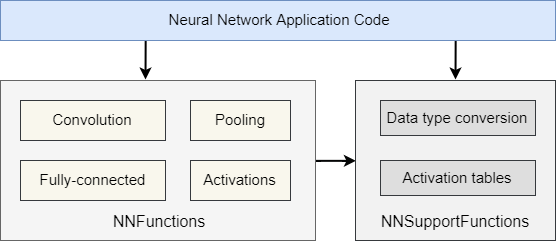

# CMSIS NN Software Library {#mainpage}

![TOC]

## Introduction {#intro}

This user manual describes the CMSIS NN software library, a collection of efficient neural network kernels developed to maximize the performance and minimize the memory footprint of neural networks on Arm Cortex-M processors.

### Experimental Floating-Point Extension {#FloatSupport}

CMSIS-NN also includes an experimental floating-point extension covering `float32`
and `float16` APIs.

The floating-point API surface is disabled by default and should only be enabled
for builds that explicitly require it. This keeps the default code size and API
surface aligned with the established integer CMSIS-NN usage model.

The floating-point API style intentionally follows the existing integer CMSIS-NN
conventions, including the TensorFlow Lite Micro influenced parameter structure,
even though `float16` is not part of the TensorFlow Lite Micro API contract.

These floating-point kernels are primarily intended for Cortex-M processors with
Helium (MVE) and hardware floating-point support. Scalar reference paths exist
for validation and fallback, but they are not the primary deployment target.
Floating-point inference should be reserved for specific use cases where integer
quantization is not possible or not acceptable, and for neural networks with
modest size and runtime requirements.

The floating-point code can also be compiled for Arm A-class processors with
`float16` support and may benefit from NEON or SVE auto-vectorization.
However, this is not an intended deployment target for CMSIS-NN float support,
and the resulting performance is expected to be suboptimal compared to libraries
designed for that class of processor. For Arm A-class CPUs, prefer optimized
inference libraries such as Arm Compute Library or XNNPACK.

The library is divided into a number of functions each covering a specific category:

 - \ref NNConv
 - \ref Acti
 - \ref FC
 - \ref SVDF
 - \ref Pooling
 - \ref Softmax
 - \ref groupElementwise
 - \ref LSTM

The figure below illustrates the CMSIS-NN block diagram.

## Supported Processors {#Processors}

CMSIS-NN targets Cortex-M processors with typically three different implementations for each function. Each implementation targets a different group of processors:

 - Processors without Single Instruction Multiple Data(SIMD) capability (e.g, Cortex-M0)
 - Processors with DSP extension (e.g Cortex-M4)
 - Processors with Arm M-Profile Vector Extension(MVE) instructions (e.g Cortex-M55)

The correct implementation is picked through feature flags and the user does not have to explicit set it.

Notes for floating-point kernels:

 - Floating-point support is mainly intended for processors with Helium and
   floating-point hardware support.
 - `float16` support is mainly intended for processors with native float16
   arithmetic support.
 - Scalar floating-point implementations are available for reference and
   fallback, but they are not the main optimization target.
 - Arm A-class CPUs with `float16`, NEON, or SVE can compile generic kernels (non-Helium variants), but
   this is not the intended deployment target. Prefer Arm Compute Library or
   XNNPACK for better performance on those processors.

## Access to CMSIS-NN {#pack}

CMSIS-NN is actively maintained in the [**CMSIS-NN GitHub repository**](https://github.com/ARM-software/CMSIS-NN) and is released as a standalone [**CMSIS-NN pack**](https://www.keil.arm.com/packs/cmsis-nn-arm/versions/) in the [CMSIS-Pack format](https://open-cmsis-pack.github.io/Open-CMSIS-Pack-Spec/main/html/index.html).

Also see [**CMSIS Documentation**](https://arm-software.github.io/CMSIS_6/) for an overview of other CMSIS software components, tools and specifications.

## Quantization Specification {#Framework}

The library follows the [int8](https://www.tensorflow.org/lite/performance/quantization_spec) and int16  quantization specification of TensorFlow Lite for Microcontrollers.

## Examples {#Examples}

An example image recognition application using TensorFlow Flow Lite for Microcontrollers as an inference engine and CMSIS-NN as the optimized library can be found in the Examples directory.

## Pre-processor Macros {#Macros}

**Feature flag based macros**

The macros below are defined in a build system based on feature flags for a chosen processor or architecture input to a compiler. These tie in to the classification in \ref Macros.

For a CMSIS-NN file compiled as `armclang -mcpu=cortex-m4 --target=arm-arm-none-eabi -I<CMSIS Core Include> -Ofast -O file.c` , the macro `ARM_MATH_DSP` is enabled as Cortex-M4 has the DSP extension as a feature.

 - `ARM_MATH_DSP`
   - Selects code for processors with DSP extension.

 - `ARM_MATH_MVEI`
   - Selects code for processors which supports MVE instructions.

 - `ARM_MATH_MVEF`
   - Selects code for processors which support MVE with floating-point instructions.

 - `ARM_MATH_MVE_FLOAT16`
   - Selects code for processors which support MVE with float16 instructions.

**User set macros**

 - `ARM_MATH_AUTOVECTORIZE`
   - Applicable when ARM_MATH_MVEI is active to let the compiler auto vectorize functions, if available, that uses inline assembly. This has to be explicitly set at compile time.

 - `ARM_NN_ENABLE_F32`
   - Enables the experimental `float32` API and implementation set.

 - `ARM_NN_ENABLE_F16`
   - Enables the experimental `float16` API and implementation set.

 - `NN_DISABLE_SPECIALIZATION`
   - Disables optional shape/layout-specific fast paths and forces the corresponding generic implementation path.
   - Useful when validating specialized kernels against the generic reference-style path.

 - `ARM_NN_USE_EXP_LUT`
   - Selects the LUT-based scalar float softmax exp approximation. This is the default if no softmax exp macro is defined.
   - Adds one 257-entry lookup table per enabled float precision:
     - float16: 257 half-words, about 514 bytes
     - float32: 257 words, about 1028 bytes

 - `ARM_NN_USE_EXP_TAYLOR`
   - Selects the Taylor/Estrin scalar float softmax exp approximation to avoid the extra lookup-table storage.
   - `ARM_NN_USE_EXP_LUT` and `ARM_NN_USE_EXP_TAYLOR` are mutually exclusive.

## Inclusive Language {#Inclusive}

This product confirms to Arm’s inclusive language policy and, to the best of our knowledge, does not contain any non-inclusive language. If you find something that concerns you, email terms@arm.com.

# Copyright Notice {#Copyright}

SPDX-FileCopyrightText: Copyright 2010-2023 Arm Limited and/or its affiliates <open-source-office@arm.com>
