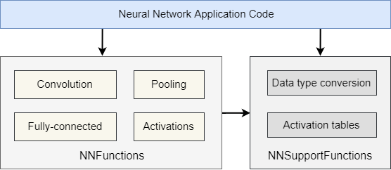

# CMSIS NN Software Library {#mainpage}

![TOC]

## Introduction {#intro}

This user manual describes the CMSIS NN software library, a collection of efficient neural network kernels developed to maximize the performance and minimize the memory footprint of neural networks on Arm Cortex-M processors.

The library is divided into a number of functions each covering a specific category:

 - \ref NNConv
 - \ref Acti
 - \ref FC
 - \ref SVDF
 - \ref Pooling
 - \ref Softmax
 - \ref groupElementwise
 - \ref LSTM

The figure below illustrates the CMSIS-NN block diagram.

## Supported Processors {#Processors}

CMSIS-NN targets Cortex-M processors with typically three different implementations for each function. Each implementation targets a different group of processors:

 - Processors without Single Instruction Multiple Data(SIMD) capability (e.g, Cortex-M0)
 - Processors with DSP extension (e.g Cortex-M4)
 - Processors with Arm M-Profile Vector Extension(MVE) instructions (e.g Cortex-M55)

The correct implementation is picked through feature flags and the user does not have to explicit set it.

## Access to CMSIS-NN {#pack}

CMSIS-NN is actively maintained in the [**CMSIS-NN GitHub repository**](https://github.com/ARM-software/CMSIS-NN) and is released as a standalone [**CMSIS-NN pack**](https://www.keil.arm.com/packs/cmsis-nn-arm/versions/) in the [CMSIS-Pack format](https://open-cmsis-pack.github.io/Open-CMSIS-Pack-Spec/main/html/index.html).

Also see [**CMSIS Documentation**](https://arm-software.github.io/CMSIS_6/) for an overview of other CMSIS software components, tools and specifications.

## Quantization Specification {#Framework}

The library follows the [int8](https://www.tensorflow.org/lite/performance/quantization_spec) and int16  quantization specification of TensorFlow Lite for Microcontrollers.

## Examples {#Examples}

An example image recognition application using TensorFlow Flow Lite for Microcontrollers as an inference engine and CMSIS-NN as the optimized library can be found in the Examples directory.

## Pre-processor Macros {#Macros}

**Feature flag based macros**

The macros below are defined in a build system based on feature flags for a chosen processor or architecture input to a compiler. These tie in to the classification in \ref Macros.

For a CMSIS-NN file compiled as `armclang -mcpu=cortex-m4 --target=arm-arm-none-eabi -I<CMSIS Core Include> -Ofast -O file.c` , the macro `ARM_MATH_DSP` is enabled as Cortex-M4 has the DSP extension as a feature.

 - `ARM_MATH_DSP`
   - Selects code for processors with DSP extension.

 - `ARM_MATH_MVEI`
   - Selects code for processors which supports MVE instructions.

**User set macros**

 - `ARM_MATH_AUTOVECTORIZE`
   - Applicable when ARM_MATH_MVEI is active to let the compiler auto vectorize functions, if available, that uses inline assembly. This has to be explicitly set at compile time.

## Inclusive Language {#Inclusive}

This product confirms to Arm’s inclusive language policy and, to the best of our knowledge, does not contain any non-inclusive language. If you find something that concerns you, email terms@arm.com.

# Copyright Notice {#Copyright}

SPDX-FileCopyrightText: Copyright 2010-2023 Arm Limited and/or its affiliates <open-source-office@arm.com>
