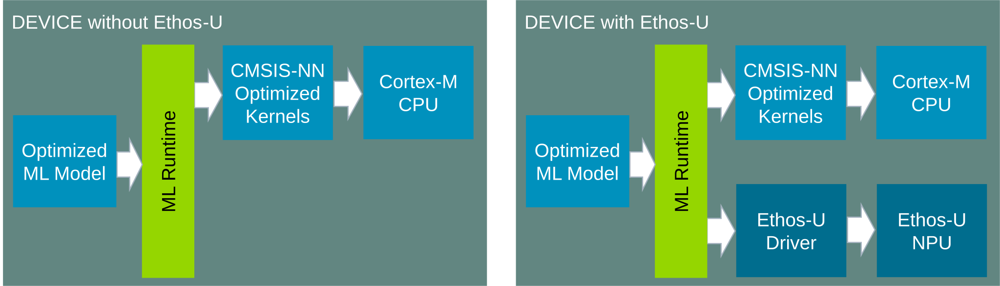

# CMSIS-NN

The CMSIS-NN software pack contains a collection of efficient neural network kernels developed to maximize performance
and minimize the memory footprint of neural networks on Arm Cortex-M processors.

[CMSIS-NN](https://arm-software.github.io/CMSIS-NN/) provides optimized implementations of common neural network
operators, including convolution, depthwise convolution, fully connected, pooling, activation, softmax, LSTM, and SVDF
functions. Machine learning runtimes use these kernels to execute an optimized model on the Cortex-M CPU. On systems
with an Arm Ethos-U NPU, a runtime can use CMSIS-NN for operators assigned to the CPU alongside operators offloaded to
the NPU.

CMSIS-NN integrates with embedded machine learning frameworks including
[LiteRT for Microcontrollers](https://developers.google.com/edge/litert/microcontrollers/overview) and
[ExecuTorch](https://docs.pytorch.org/executorch/stable/backends/arm-cortex-m/arm-cortex-m-overview.html). LiteRT can
deploy models created with TensorFlow, while the ExecuTorch Arm Cortex-M backend uses CMSIS-NN kernels to accelerate
quantized PyTorch models.

The integer kernels follow the `int8` and `int16` quantization specifications used by LiteRT. Selected operators also
support `int4` weights with `int8` activations. Experimental `float16` and `float32` APIs are available for use cases
where integer quantization is not suitable; these APIs are disabled by default and primarily target processors with Arm
Helium Technology.

CMSIS-NN selects an implementation according to the target processor features:

- **Pure C**: portable implementations for all supported Cortex-M processors.
- **DSP extension**: optimized implementations using SIMD instructions.
- **Helium**: optimized implementations using the Arm M-profile Vector Extension (MVE).

## Availability

CMSIS-NN is available under the [Apache 2.0 license](https://github.com/ARM-software/CMSIS-NN/blob/main/LICENSE) and is
distributed as source code and as a standalone
[CMSIS-Pack](https://www.keil.arm.com/packs/cmsis-nn-arm/versions/).

## Supported Compilers

- CMSIS-NN is tested with Arm Compiler 6 and Arm GNU Toolchain.
- IAR compiler is not tested and may have compilation or performance issues.
- Host compilation is not supported out of the box. The C implementation may be compiled for a host with minor
  stubbing.

## Links

- [Documentation](https://arm-software.github.io/CMSIS-NN/)
- [Repository](https://github.com/ARM-software/CMSIS-NN)
- [Issues](https://github.com/ARM-software/CMSIS-NN/issues)
